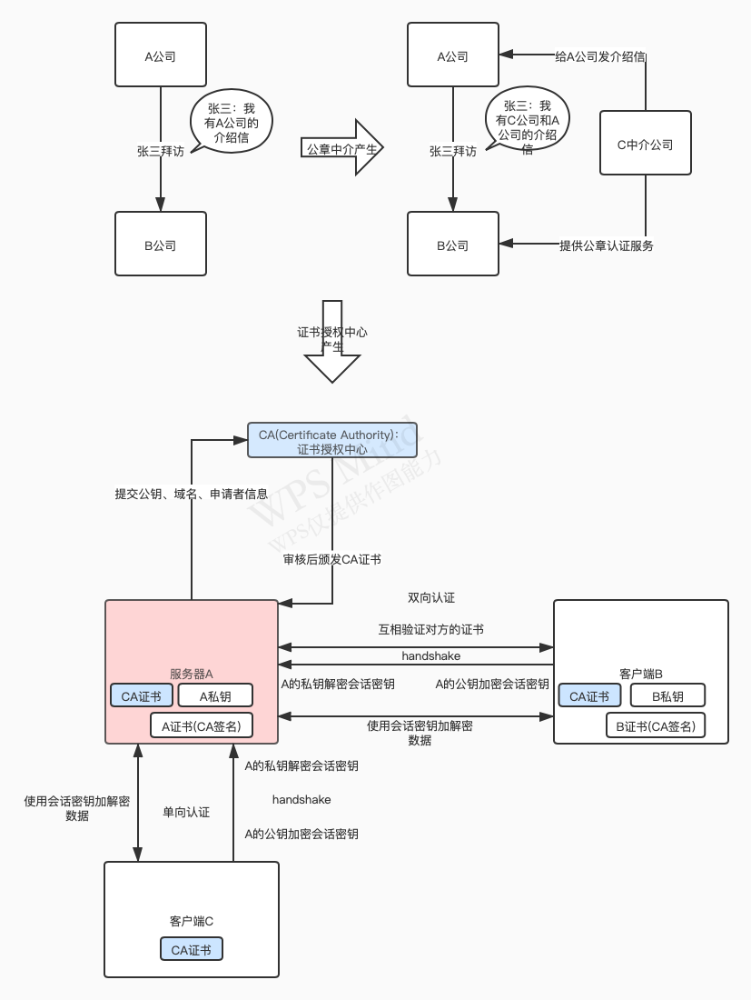

# 使用TLS (HTTPS) 保护docker守护进程套接字

如果您需要以安全的方式通过 HTTP 而不是 SSH 访问 Docker，您可以通过指定 tlsverify 标志并将 Docker 的 tlscacert 标志指向受信任的 CA 证书来启用 TLS (HTTPS)。

在守护进程模式下，它只允许来自由该 CA 签署的证书进行身份验证的客户端的连接。 在客户端模式下，它仅连接到具有由该 CA 签署的证书的服务器。

***使用 TLS 和管理 CA 是一个高级主题。 在生产中使用之前，请先熟悉 OpenSSL、x509 和 TLS。***


## 1. CA证书的产生及基本原理

   


## 2. 生成公钥和申请CA证书

   生成RSA公钥：

   ```groovy
   //输入两次密码要一致
   openssl genrsa -aes256 -out ca-key.pem 4096
   ```

   使用公钥申请CA证书：

   ```groovy
   //x509是通用的证书文件格式定义.通过x509对应的函数可以解读CA证书中的信息。
   //输入申请者信息
   //要注意的是Common Name这里，要填写成使用SSL证书(即：https协议)的服务器域名或主机名，否则浏览器会认为不安全。
   //证书默认有效期是30天
   openssl req -new -x509 -days 365 -key ca-key.pem -sha256 -out ca.pem
   ```

   

## 3. 生成服务器私钥和证书

   ```groovy
   //生成服务器私钥
   openssl genrsa -out server-key.pem 4096
   ```

   ```groovy
   //生成服务器证书请求文件
   //证书请求用户信息"/CN=$HOST", HOST设置为服务器域名
   openssl req -subj "/CN=$HOST" -sha256 -new -key server-key.pem -out server.csr
   ```

   ```groovy
   //配置信息
   echo subjectAltName = DNS:$HOST,IP:10.10.10.20,IP:127.0.0.1 >> extfile.cnf
   ```

   ```groovy
   //配置信息
   echo extendedKeyUsage = serverAuth >> extfile.cnf
   ```

   ```groovy
   //使用CA和公钥签名服务器证书
   openssl x509 -req -days 365 -sha256 -in server.csr -CA ca.pem -CAkey ca-key.pem \
     -CAcreateserial -out server-cert.pem -extfile extfile.cnf
   ```

   

## 4. 生成客户端私钥和证书

   ```groovy
   //生成客户端私钥
   openssl genrsa -out key.pem 4096
   ```

   ```groovy
   //生成客户端证书请求文件
   //证书请求用户信息"/CN=client"
   openssl req -subj '/CN=client' -new -key key.pem -out client.csr
   ```

   ```groovy
   //配置信息
   echo extendedKeyUsage = clientAuth > extfile-client.cnf
   ```

   ```groovy
   //使用CA和公钥签名客户端证书
   openssl x509 -req -days 365 -sha256 -in client.csr -CA ca.pem -CAkey ca-key.pem \
     -CAcreateserial -out cert.pem -extfile extfile-client.cnf
   ```

   

## 5. 修改为只读权限，防止证书被修改

   ```groovy
   chmod -v 0400 ca-key.pem key.pem server-key.pem
   ```

```groovy
chmod -v 0400 ca-key.pem key.pem server-key.pem
```

```groovy
//删除证书签名请求和配置文件
rm -v client.csr server.csr extfile.cnf extfile-client.cnf
```


## 6. 开启TLS验证服务

修改docker.service启动配置：

```groovy
vi /usr/lib/systemd/system/docker.service
```

在ExecStart后面加入开启tls验证及api端口2376:

```groovy
ExecStart=/usr/bin/dockerd \
-H fd:// --containerd=/run/containerd/containerd.sock \
--tlsverify \
--tlscacert=/etc/docker/certs/ca.pem \
--tlscert=/etc/docker/certs/server-cert.pem \
--tlskey=/etc/docker/certs/server-key.pem \
-H=0.0.0.0:2376
```


## 7. 客户端发起https请求

```groovy
curl https://$HOST:2376/images/json \
  --cert ~/.docker/cert.pem \
  --key ~/.docker/key.pem \
  --cacert ~/.docker/ca.pem
```


***参考docker安全访问使用说明：https://docs.docker.com/engine/security/protect-access/***

***参考openssl中文网：https://www.openssl.net.cn/***

